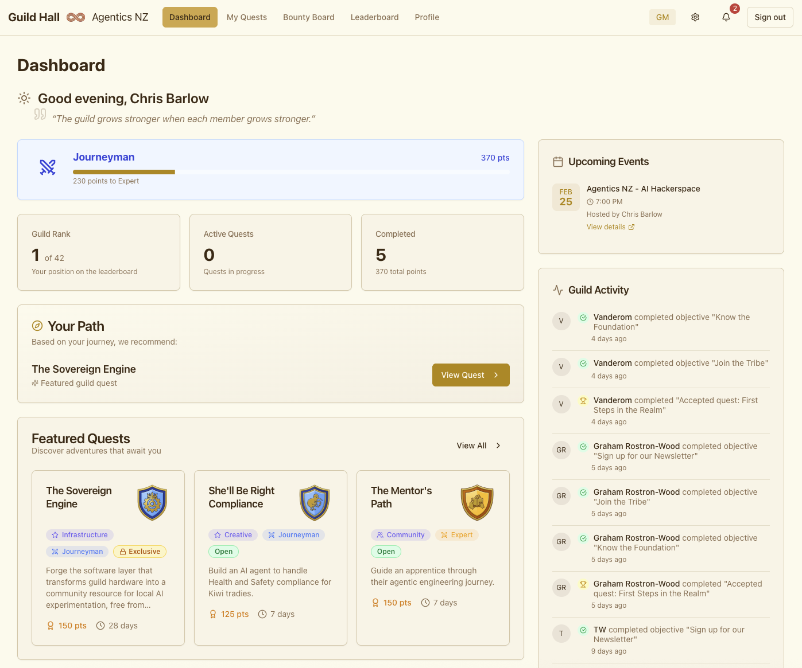

# Welcome to the Guild Hall, adventurer! Make yourself at home.

> *Do quests, not goals.*

**[Try it live](https://guildhall.agentics.org.nz)**

You have probably set goals before. And you have probably abandoned most of them. That is not a character flaw — it is a design flaw. Goals frame the present as inadequate, turn obstacles into failures, and make progress feel like obligation.

Quests flip this entirely. On a quest, obstacles are *expected*. Challenges are part of the story. Struggle is proof you are on the right path. And when you finish, you have not just checked a box — you have become someone different.

Guild Hall is a platform where Game Masters design quests for their communities — and community members actually complete them.



## What a Quest Looks Like

You run a local AI community. You have a chat group, monthly meetups, and members who keep asking: *"What should I learn next?"*

You open Guild Hall and create a quest called **"The Prompt Whisperer."** It is an Apprentice-level challenge worth 50 points. You write three objectives: read a prompting guide, build prompt templates, and share your results with the group. You set a two-week deadline and require link evidence for the final objective. You hit publish. The quest appears on the **Bounty Board**.

That evening, a new member browses the Bounty Board without logging in. She sees your quest, reads the description, and signs up. Over the next week she works through the objectives, submitting evidence as she goes. You get a notification, review her submission, leave feedback, and approve it. She earns 50 points, unlocks her first badge, and levels up from **Apprentice** to **Journeyman**. Guild Hall recommends her next quest: **"Local Model Liberation"** — a harder challenge worth 100 points.

She did not set a goal. She went on a quest. The difference is not semantic. The difference is that she finished.

## What You Get

**As a Quester**, you choose your own adventure:

| Capability | What it means |
|------------|---------------|
| Bounty Board | Browse and filter quests without signing up |
| Quest Progress | Track objectives, submit evidence, earn points |
| Skill Tiers | Progress from Apprentice through Journeyman, Expert, Master, to Legend |
| Side Quests | Optional challenges for bonus rewards |
| Achievements & Badges | Unlock milestones and earn visual recognition |
| Leaderboard | Compete for rankings — with privacy controls so you choose your visibility |

**As a Game Master**, you design the experience:

| Capability | What it means |
|------------|---------------|
| Quest Builder | Create quests with multiple objectives, difficulty levels, and deadlines |
| Evidence Review | Approve or reject submissions with feedback that helps your community grow |
| Side Quests | Create optional challenges alongside main quests |
| Templates | Save your best quest designs for reuse |
| Skill Tier Config | Customise tier thresholds, icons, and colours for your guild |
| Community Tools | Manage banners, philosophy quotes, and email digests |

## How It Works

The quest loop is simple:

**Create → Accept → Complete → Review → Reward**

A Game Master creates a quest with objectives, deadlines, and a difficulty level. Community members browse the Bounty Board and accept quests that resonate. They work through objectives at their own pace, submitting evidence along the way. The GM reviews submissions — approving with encouragement or sending back with feedback. Completed quests earn points, badges, and skill tier progression.

## Getting Started

### Prerequisites

- Node.js 20+
- npm
- [Supabase](https://supabase.com) account (free tier works)

### Setup

```bash
git clone https://github.com/cgbarlow/guild-hall.git
cd guild-hall
npm install

# Configure environment
cp .env.example .env.local
# Edit .env.local — at minimum you need:
#   NEXT_PUBLIC_SUPABASE_URL
#   NEXT_PUBLIC_SUPABASE_ANON_KEY
#   SUPABASE_SERVICE_ROLE_KEY
# See .env.example for all optional variables (branding, email, events)

# Push database schema
npx supabase login
npx supabase link --project-ref YOUR_PROJECT_REF
npx supabase db push

# Start dev server
npm run dev
# Open http://localhost:3000
```

<details>
<summary>Testing</summary>

```bash
npm test              # Run all tests
npm run test:watch    # Watch mode
npm run type-check    # TypeScript checking
npm run lint          # ESLint
```

</details>

### Deployment

Deploys to Netlify on push to `main`. The included `netlify.toml` is pre-configured with the Next.js plugin, security headers, and static asset caching. Set your environment variables in the Netlify dashboard.

## Tech Stack

| Layer | Technology |
|-------|------------|
| Frontend | Next.js 15 (App Router) |
| Runtime | React 18 |
| Backend | Supabase (PostgreSQL, Auth, Realtime) |
| Hosting | Netlify |
| Styling | Tailwind CSS |
| UI Components | shadcn/ui + Radix |
| State | TanStack Query |
| Forms | React Hook Form + Zod |
| Testing | Vitest + Testing Library |
| Language | TypeScript |

## Reference Guilds

Guild Hall supports multiple guilds, each with their own themes, quests, and communities.

The first reference implementation is the **Agentics NZ Guild**, focused on building sovereign AI capability in New Zealand. It includes quests spanning Apprentice to Master difficulty across Learning, Challenge, Creative, and Community categories.

[Guild Reference](docs/guilds/agentics-nz/GUILD-REFERENCE.md) | [Quest Catalog](docs/guilds/agentics-nz/QUEST-CATALOG-published.md) | [All Quests](docs/guilds/agentics-nz/quests/)

## Documentation

| Area | Contents |
|------|----------|
| Vision & Planning | [North Star](docs/NORTH-STAR.md) · [Roadmap](docs/ROADMAP.md) · [Requirements](docs/REQUIREMENTS.md) |
| Architecture Decisions | [ADRs](docs/adrs/) — structured decision records in WH(Y) format |
| Technical Specifications | [Specs](docs/specs/) — schemas, auth flows, configs, and more |
| Delivery | [Delivery Report](docs/DELIVERY-REPORT.md) · [Implementation Plan](docs/IMPLEMENTATION-PLAN.md) |
| Screenshots | [Full preview gallery](docs/SCREENSHOTS.md) |

<details>
<summary>Project Layout</summary>

The app uses Next.js App Router with route groups: `(auth)` for login and registration, `(dashboard)` for user-facing pages (bounty board, quests, leaderboard, profile, settings), and `(gm)` for Game Master tools (quest management, evidence review, tier configuration, templates).

Components, hooks, and utilities live under `src/components/`, `src/lib/hooks/`, and `src/lib/utils/`. Database migrations are in `supabase/migrations/` and edge functions (email digests) in `supabase/functions/`.

</details>

## Contributing

Contribution guidelines coming soon.

## License

*License TBD*

## Acknowledgments

Built on the philosophy from [Do Quests, Not Goals](https://www.raptitude.com/2024/08/do-quests-not-goals/) by David Cain — the insight that goals feel like obligations while quests feel like adventures.

---

*"Every quest has a dragon. When you finally face it, victory is closer than you think."*
